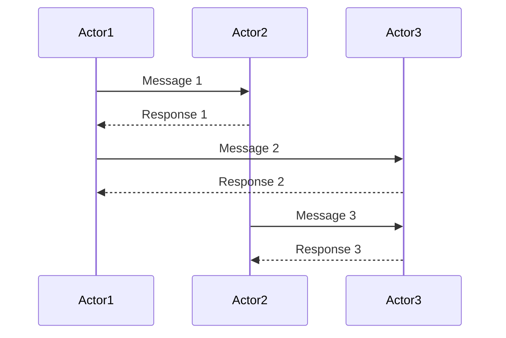

<div align="center">

# Hannibal

<!-- Crates version -->
[](https://github.com/hoodie/hannibal/actions?query=workflow%3A"\"Build")
[](https://crates.io/crates/hannibal/)
[](https://crates.io/crates/hannibal)
[](https://docs.rs/hannibal)
[](https://github.com/hoodie/hannibal/graphs/contributors)

[](https://crates.io/crates/hannibal/)

a small actor library
</div>



In this example:
- `Actor1` sends `Message 1` to `Actor2`.
- `Actor2` responds with `Response 1` to `Actor1`.
- `Actor1` sends `Message 2` to `Actor3`.
- `Actor3` responds with `Response 2` to `Actor1`.
- `Actor2` sends `Message 3` to `Actor3`.
- `Actor3` responds with `Response 3` to `Actor2`.

## Features

- Async actors.
- Actor communication in a local context.
- Using Futures for asynchronous message handling.
- Typed messages (No `Any` type). Generic messages are allowed.

## Examples

```rust

```

## New since 0.12

Hannibal until v0.10 was a fork of [xactor](https://crates.io/crates/xactor).
Since 0.12 it is a complete rewrite with the following features:

- Strong and Weak Senders and Callers (as in actix)
- Exchangeable Channel Implementation
  - included: bounded and unbounded
- Streams are Handled by launching an actor together with a stream.
  - Avoids extra tasks and simplifies the logic.
  The actor lives only as long as the stream.
- Actor trait only brings methods that you should implement (better "implement missing members" behavior)
- derive macros for `Actor`, `Service` and `Message`
- Owning Addresses
  - allows returning actor content after stop
- Builder

## TODO

- [x] Async EventLoop
- [x] Stopping actors + Notifying Addrs
- [x] environment builder
  - [x] return actor after stop
- [x] impl Caller/Sender
  - same old, same old
  - [x] stream handling
- [x] service
  - [x] restarting actors
  - [x] special addr that only allows restarting
- [x] manage child actors
- [x] broker
  - [ ] look into why there should be a thread local broker
- [x] deadlines (called timeouts)
- [x] intervals and timeouts
- [x] register children
- [ ] stream handling service/broker
   - [ ] allow a service that handles e.g. [signals](https://docs.rs/async-signals/latest/async_signals/struct.Signals.html)
   - [ ] (optional) have utility services already?
   - [ ] SUPPORT restarting stream handlers
- [x] logging and console subscriber
- [ ] stop reason
- [x] owning addr
   - returns actor again after stop
- [x] builder to configure
  - channel capacity
  - restart strategy


## Stretch Goals
- [x] can we select!() ?
  - yes, we do that for streams now
- [ ] maybe impl SinkExt for Addr/Sender
- [x] maybe impl async AND blocking sending
